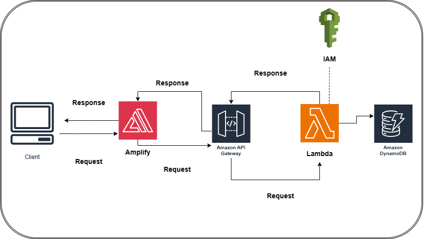

# AWS-Power-Calculator-Web-App

The Power Calculator Web App is an end-to-end web application created and hosted on AWS. The application allows users to calculate the power of a base number raised to an exponent. It leverages various AWS services for different functionalities, providing a scalable and secure solution.

## Features

- Input fields for the base and exponent.
- Button to trigger the power calculation.
- Display of the calculation result.

## System Design

## Technologies Used

- HTML
- JavaScript
- AWS Amplify
- AWS API Gateway
- AWS Lambda
- AWS DynamoDB
- AWS Identity and Access Management (IAM)

## AWS Services and Components

1. **AWS Amplify:**
   - Used to host the web application and streamline the deployment process.

2. **AWS API Gateway:**
   - Creates the API endpoints that handle communication between the web app and the Lambda function.

3. **AWS Lambda:**
   - Provides scalable and serverless execution of the power calculation function.

4. **AWS DynamoDB:**
   - Stores the results of the calculations in a NoSQL database for future reference.

5. **AWS IAM:**
   - Manages Identity and Access Management, granting the necessary permissions for Lambda to interact with DynamoDB securely.

## Demo
